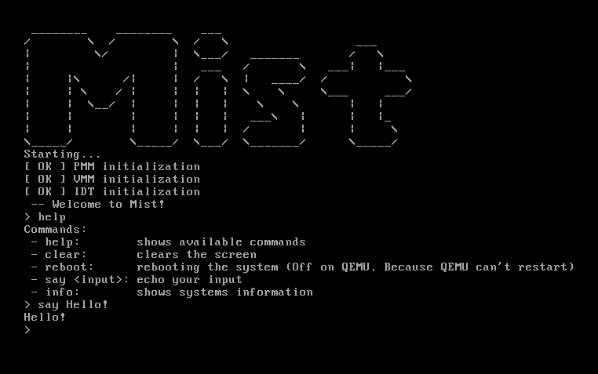
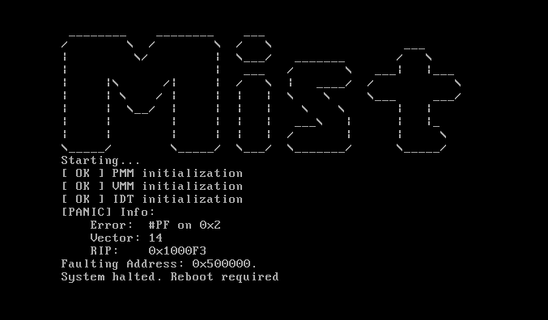
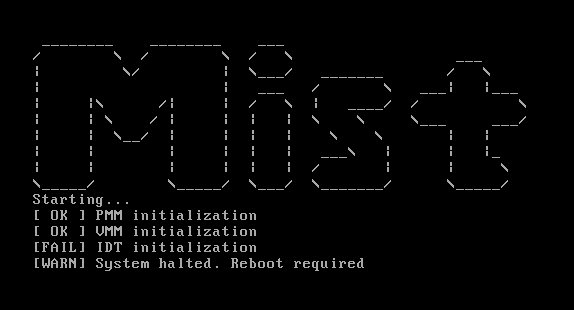

<div align=center>

# 🌫️ Mist 🌫️


<br>

[](LICENSE)
[]()
[]()<br>


---

[](README.md) [](README_ru.md)

---

**Mist** is a simple x86_64 operating system made from scratch

This training project made for learning how the PC works. Every bug fix and improvment are welcome, so _don't be shy to contribute_.
It uses MIT license so you can do anything with this code!
</div>

---
<br>

## 🤔 What can it do?
- Boot with own bootloader made in assembly
- Control physical memory using PMM
- Manage virtual memory using VMM
- Handle interrupts using IDT
- Listen keyboard using keyboard and PIC drivers
- Output anything to VGA using VGA driver
- Process any shell commands
- etc..

And all of this with [own C standard library](https://github.com/ImLfyz/Mist/msc/mistd)!

There is [documentation](https://github.com/ImLfyz/Mist/docs) to explain you every function in code

<div align=center>

## Gallery

<br>



---



---



</div>

<br>
<br>

## 🏁 Get started

### Requirements:
- QEMU
- Clang
- NASM
- Make

---

You can start with 2 ways:

1. Compile by yourself:
<details>

<br>

  - Clone Mist repo:

  ```
  git clone https://github.com/ImLfyz/Mist
  ```
  - Compile (Clang):

  ```
  cd Mist
  make
  ```
  - Run with QEMU:

  ```
  make run
  ```

</details>

<br>

2. Use already compiled Mist.img from releases:
<details>

<br>

  - Copy Mist.img:
  ```
  wget https://github.com/ImLfyz/Mist/releases/download/v0.10/Mist.img
  ```
  - Run with QEMU:
  ```
  qemu-system-x86_64 -drive format=raw,file=Mist.img -no-reboot
  ```

</details>

## 😰 Issues
***Mist - young project made by 16 y.o. student***

It may contain bugs and errors

If you have one of these, you can visit the [issues](https://github.com/ImLfyz/Mist/issues)

Also you can do pull requests with your code. You're welcome!
